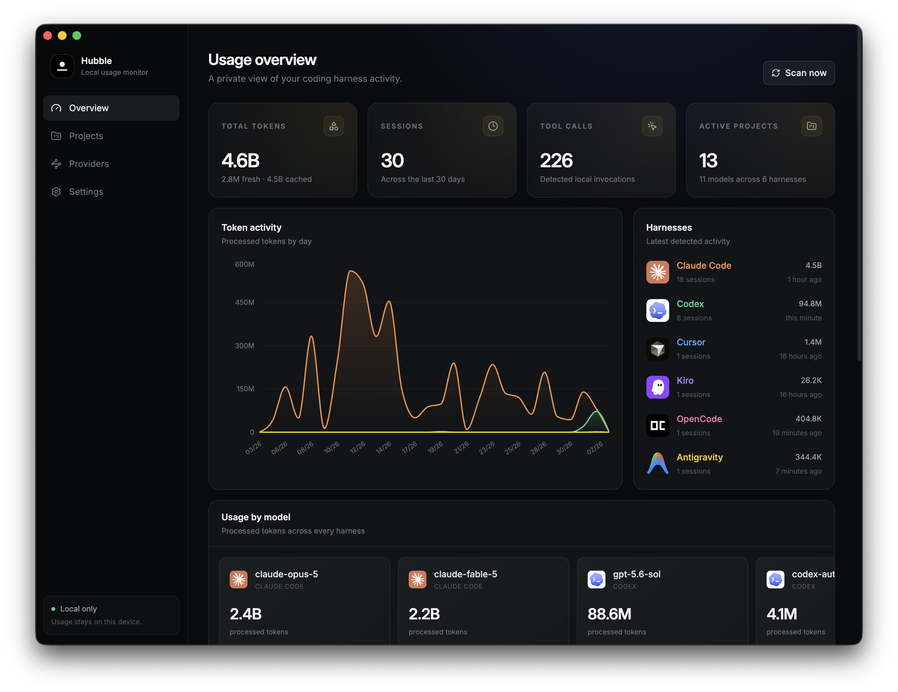

  

  <h1>Hubble</h1>

  
<strong>Your personal coding agent observability dashboard.</strong>

  

    
    
    
    
  

  
One beautiful, private view of how you build with AI.

---

Hubble brings the activity scattered across your coding agents into one focused desktop experience. See which tools are active, understand where your tokens are going, discover your most active projects, and follow your momentum over time—without sending your development history to another cloud.

  

## Every agent. One horizon.

Your workflow is bigger than a single assistant. Hubble gives Claude Code, Codex, Cursor, Kiro, OpenCode, and Google Antigravity a shared language, turning fragmented local activity into a clear view of your work.

Move between tools as freely as you like. Hubble keeps the wider picture in sight.

## See the work behind the work

- **A command center for your coding agents** — Scan recent activity, sessions, processed tokens, and tool usage at a glance.
- **Model-level visibility** — Understand which models power your workflow with a horizontally browsable usage view.
- **Project momentum** — Find your most active repositories and explore a GitHub-inspired contribution grid across the last 30 days.
- **A timeline you can actually read** — Compare activity across harnesses with consistent colors and a unified daily trend.
- **Quietly present** — Keep Hubble close in the system tray and open the full dashboard only when you need it.
- **Built for focus** — A polished native desktop experience, from its animated launch to its dense, distraction-free dashboard.

## Private by design

Hubble reads supported activity already present on your computer and keeps its normalized history in Hubble's own local database. Your usage story remains useful even as source logs change, age out, or disappear.

No account. No hosted analytics service. No credentials copied into Hubble. Your coding activity stays yours.

## Understand your real workflow

Token totals alone never tell the whole story. Hubble pairs them with sessions, active projects, model mix, cache activity, tool calls, and day-by-day trends—giving you a more honest picture of how coding agents fit into your craft.

Whether you are exploring a new model, balancing multiple subscriptions, or simply curious about where your attention goes, Hubble makes the invisible visible.

## Your work, in orbit

Hubble is the observability layer for the way modern software gets built: many projects, many models, many agents—one personal view.

  <strong>Stay local. See clearly. Build better.</strong>
    
  <a href="https://github.com/annjawn/hubble-view/releases">Explore Hubble releases</a>

